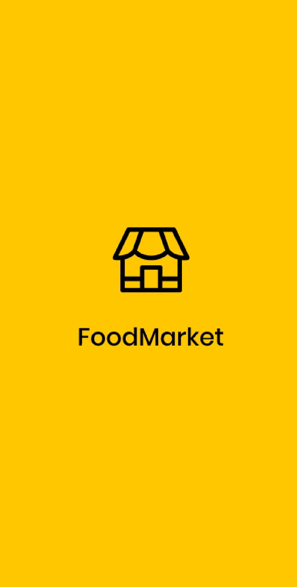
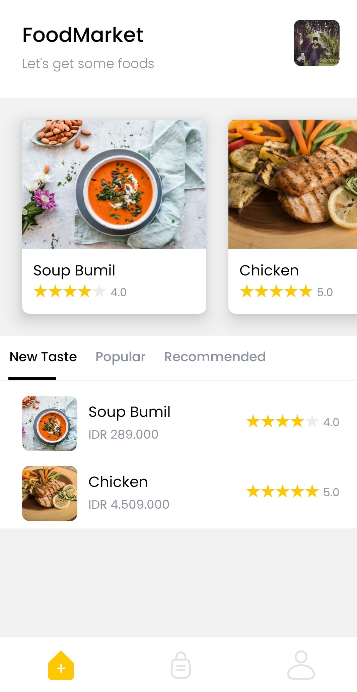
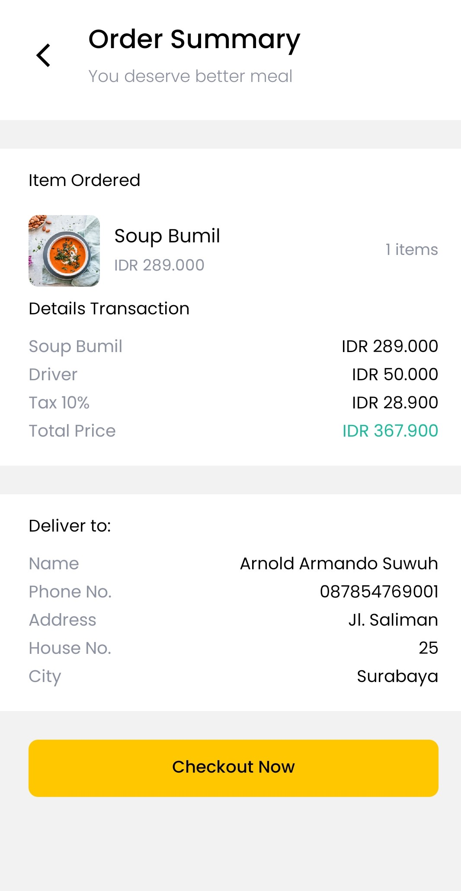
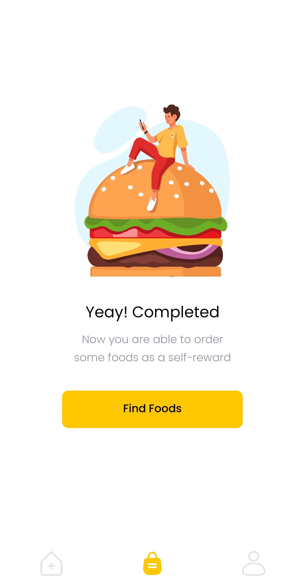

# Food Market
Food Market merupakan sebuah project dari **BuildWithAngga** dengan menggunakan [React Native](http://bit.ly/BWAFMREACT "BWAFOODMARKET React Native") & [Flutter](http://bit.ly/BWAFM "BWAFOODMARKET Flutter") dengan Back-End menggunakan Laravel 8

---
## Fitur
- [x] API
- [x] Login
- [x] Register
- [x] Food List
- [x] Order List 
- [x] Payment Gateway ([Midtrans](https://midtrans.com/id "Midtrans")) 
---
## Tools
Tools yang digunakan :
### foodmarket-backend
1. [Composer](https://getcomposer.org/)
2. [Laravel 8](https://laravel.com/)
3. [Jetsream](https://jetstream.laravel.com/)
4. [Tailwind CSS](https://tailwindcss.com/)
5. [Laragon](https://laragon.org/)
6. [XAMPP](https://www.apachefriends.org/)
7. [phpMyAdmin](https://www.phpmyadmin.net/)
### Food Market React Native
1. [Node.js](https://nodejs.org/)
2. [Yarn](https://yarnpkg.com/)
3. [React Native](https://reactnative.dev/)
### Food Market Flutter
1. [Flutter SDK](https://flutter.dev/)
### Food Market Kotlin
1. [Kotlin](https://kotlinlang.org/)
### Penunjang
1. [Visual Studio Code](https://code.visualstudio.com/)
2. [Figma](https://www.figma.com/)
3. [Postman](https://www.postman.com/)
4. [Github](https://github.com/)
5. [Java JDK 8](https://www.oracle.com/java/technologies/javase/javase-jdk8-downloads.html)
6. [Android Studio](https://developer.android.com/studio)
7. [Android SDK](https://developer.android.com/studio)
---
## Project Repository
1. Back-End Laravel [foodmarket-backend](https://github.com/arnoldarmandosuwuh/foodmarket-backend "Food Market Backend")
2. Project React Native [Food Market React Native](https://github.com/arnoldarmandosuwuh/FoodMarketRN "Food Market React Native")
3. Project Flutter [Food Market Flutter](https://github.com/arnoldarmandosuwuh/food_market_flutter "Food Market Flutter")
4. Project Kotlin [Food Market Kotlin](https://github.com/arnoldarmandosuwuh/FoodMarketKotlin "Food Market Kotlin")
---
## Preview

---
## Kelas Tutorial
Untuk kelas tutorial dapat langsung mengakses [BuildWithAngga](https://www.buildwithangga.com/kelas "Kelas BuildWithAngga"). Informasi lebih lanjut kelas Food Market [React Native](http://bit.ly/BWAFMREACT "BWAFOODMARKET React Native"), [Flutter](http://bit.ly/BWAFM "BWAFOODMARKET Flutter") & [Kotlin](http://bit.ly/BWAFMKOTLIN "BWAFOODMARKET Kotlin")